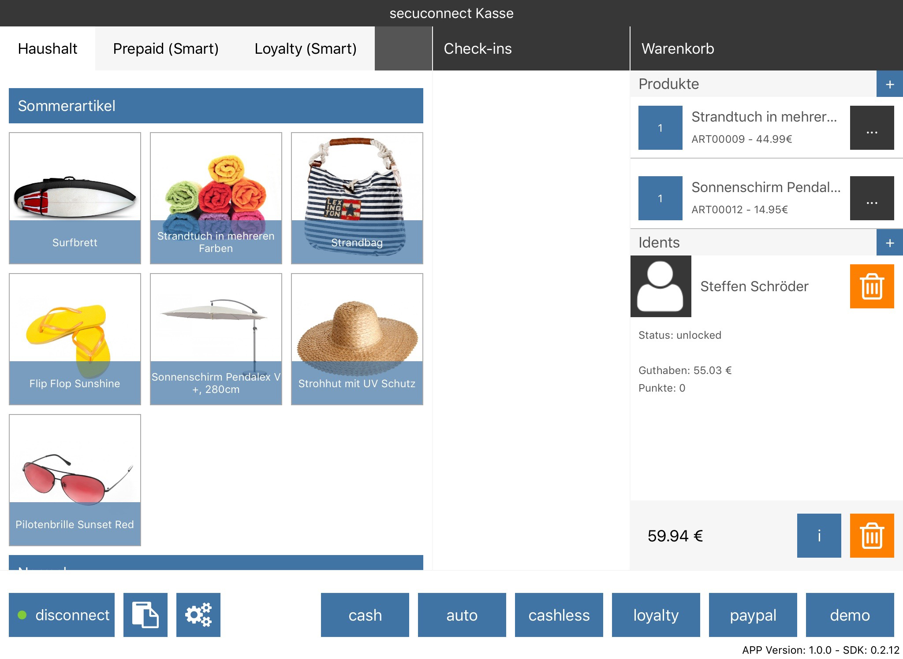

# iOS Sample applications

## Cashier demo

The cashier demo is an iOS app written in Swift.

### Links

* [Sourcecode on Github](https://github.com/secucard/secucard-ios-cashier-app)
* Appstore (comming soon)

### Building

1. clone from repositoriy: `git clone https://github.com/secucard/secucard-ios-cashier-app.git CashierApp`
2. cd into `CashierApp`
3. run `pod install`
4. run `open CashierApp.xcworkspace`
5. Build or run the CashierApp Scheme

### Showcase

This app is a demostration how to integrate and use all availables secuconnect features in an iOS cashier system.

### Screenhosts

